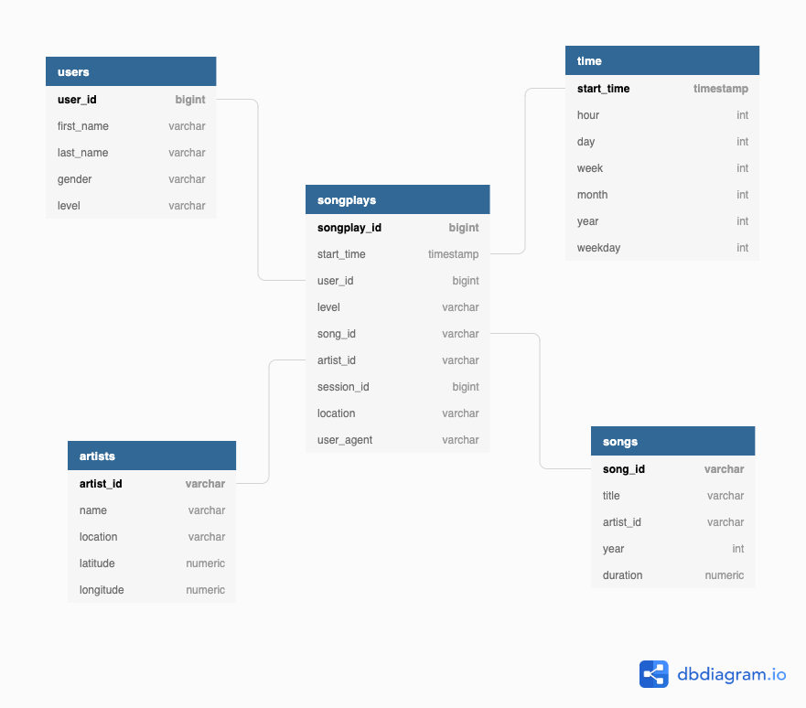

## Purpose of the Database
A startup called Sparikify wants to analyze the data they've been collecting on songs and user activity on their new music streaming app. This database was primarly designed keeping their analytics team in mind. They are particularly interested in understanding what songs users are listening to. This database provides a RDBMS platform to store all the data required for their analytics. 

## Database Schema design
* Datamodeling was implemented with **PostgreSQL** 
* Star Schema was chosen as the database schema here because the fact tables and dimensional tables that were modeled contains 1 to many relationships.

### Fact Table
* **songplays** - records in log data associated with song plays i.e. records with page NextSong

### Dimension Table
* **users** - users in the app
* **songplays** - songs in music database
* **songplays** - artists in music database
* **songplays** - timestamps of records in songplays broken down into specific units

### Data Model

## ETL Pipeline 

ETL pipeline was built using python to ingest source data from json files to relational tables. Pandas library was used to perform any data transformations or filters. 

## Files/Folders available in the repo

* **Data** - Folder containing Json source files 
* **create_tables.py** - Python script to drop and create tables
* **sql_queries.py** - Python script containing all the SQL queries required
* **etl.ipynb** - Jupyter notebook used to ingest only one Json file
* **etl .py** - Python script to load the whole datasets
* **datamodel.png** - ERD diagram depecting the tables and their relationships
* **test.ipynb** - Jupyter notebook to verify the ingested data

## Commands to run the pipeline from console

1. `python create_tables.py`
2. `python etl.py`

Final data can be verified using the select queries available in test.ipynb

